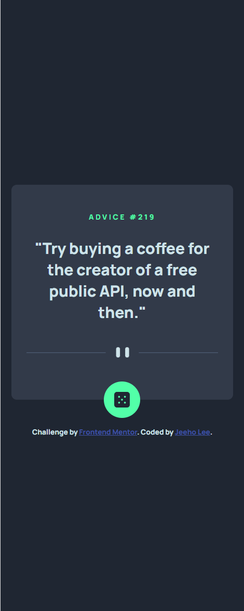
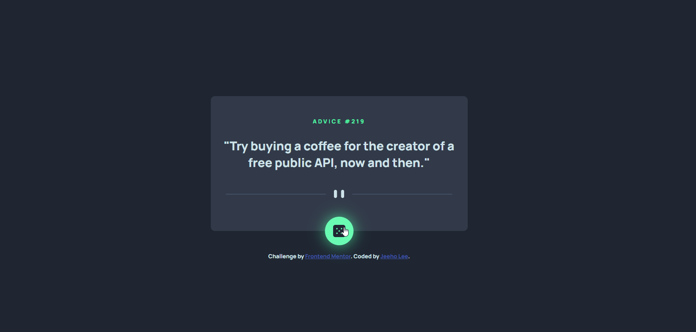

# Frontend Mentor - Advice generator app solution

This is a solution to the [Advice generator app challenge on Frontend Mentor](https://www.frontendmentor.io/challenges/advice-generator-app-QdUG-13db). Frontend Mentor challenges help you improve your coding skills by building realistic projects.

## Table of contents

- [Overview](#overview)
  - [The challenge](#the-challenge)
  - [Screenshot](#screenshot)
  - [Links](#links)
- [My process](#my-process)
  - [Built with](#built-with)
  - [What I learned](#what-i-learned)
  - [Continued development](#continued-development)
  - [Useful resources](#useful-resources)
- [Author](#author)

## Overview

### The challenge

Users should be able to:

- View the optimal layout for the app depending on their device's screen size
- See hover states for all interactive elements on the page
- Generate a new piece of advice by clicking the dice icon

### Screenshot

### Links

- Solution URL: [https://github.com/jeeheezy/FEM-Advice-Generator-App](https://github.com/jeeheezy/FEM-Advice-Generator-App)
- Live Site URL: [https://jeeheezy.github.io/FEM-Advice-Generator-App/](https://jeeheezy.github.io/FEM-Advice-Generator-App/)

## My process

### Built with

- Semantic HTML5 markup
- CSS custom properties
- Flexbox
- Mobile-first workflow
- Javascript

### What I learned

This exercise was a good way of learning what APIs are and how specifically the Fetch API works to call the slip advice API provided. It was also a good lesson on dealing with Promises and making use of then or async functions with await to be able to work with the resolved or rejected Promises. 

### Continued development

Promises are still confusing, as are asynchronous functions, so I'd like to keep learning on how they work and how to effectively use them. Additionally, working with APIs I'm sure will be a big portion of any future development so I'd like to get familiar with how to work with different APIs and implementing them into projects.

### Useful resources

- [MDN Web Docs for Using Fetch API](https://developer.mozilla.org/en-US/docs/Web/API/Fetch_API/Using_Fetch) - This page on using the Fetch API helps understand much of what's possible and gives plenty of examples to help understand what they are explaining. While there's much that was not applied in this project, I specifically found the "Checking that the fetch was successful" portion of the document helpful.

- [ChatGPT 3.5](https://chat.openai.com/) - ChatGPT is a good great resource when trying to understand where to begin and why something might be written the way it is. It was particularly helpful for me this time around in undestanding async/await, as well as how the .json method works since at first glance it seemed like an object but the documentations stated it was a promise.

## Author

- LinkedIn - [Jeeho Lee](https://www.linkedin.com/in/jeeho-lee-719852182/)
- Frontend Mentor - [@jeeheezy](https://www.frontendmentor.io/profile/jeeheezy)

